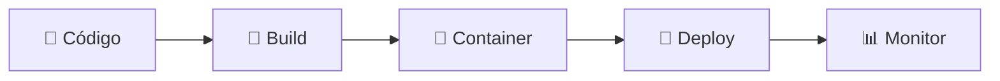

<div align="center">
  
</div>

<div align="center">

> 🎓 Projeto desenvolvido durante a **Imersão DevOps** da [Alura](https://cursos.alura.com.br/imersao/imersao-devops-google)  
> Uma jornada prática explorando ferramentas e conceitos fundamentais de DevOps com Google Cloud.


[](https://www.docker.com/)
[](https://fastapi.tiangolo.com/)
[](https://www.python.org/)
[](https://cloud.google.com/)

</div>

---

## 📋 Índice

- [🐳 Containerização](#-containerização)
- [🚀 Como Executar](#-como-executar)
- [📊 Monitoramento](#-monitoramento)
- [🔧 Configurações DevOps](#-configurações-devops)
- [📁 Estrutura DevOps](#-estrutura-devops)
- [🔄 Pipeline de Deploy](#-pipeline-de-deploy)
- [🛠️ Tecnologias DevOps Utilizadas](#%EF%B8%8F-tecnologias-devops-utilizadas)
- [📚 Sobre a Imersão DevOps Alura](#-sobre-a-imersão-devops-alura)

## 🐳 Containerização

### Docker
O projeto utiliza **Docker** para containerização da aplicação FastAPI:

- **Dockerfile**: Container otimizado baseado em Python 3.13-slim
- **Multi-stage**: Utiliza cache de layers para builds mais rápidos
- **Segurança**: Execução com usuário não-root
- **Health Check**: Monitoramento automático da saúde do container

### Docker Compose
Orquestração de serviços com **docker-compose.yml**:

```yaml
services:
  ellis-api:
    build: .
    ports:
      - "8000:8000"
    restart: unless-stopped
    healthcheck:
      test: ["CMD-SHELL", "curl -f http://localhost:8000/docs || exit 1"]
      interval: 30s
      timeout: 10s
      retries: 3
```

## 🚀 Como Executar

### Usando Docker Compose (Recomendado)
```bash
cd ellis
docker-compose up -d
```

### Usando Docker diretamente
```bash
cd ellis
docker build -t ellis-api .
docker run -p 8000:8000 ellis-api
```

### 🌐 Acessar a Aplicação
Após executar, acesse:
- **API**: http://localhost:8000
- **Documentação Swagger**: http://localhost:8000/docs
- **Redoc**: http://localhost:8000/redoc

## 📊 Monitoramento

### Health Checks
- **Endpoint**: `/docs` (FastAPI Swagger UI)
- **Intervalo**: 30 segundos
- **Timeout**: 10 segundos
- **Tentativas**: 3 antes de marcar como unhealthy

### Logs
```bash
# Visualizar logs em tempo real
docker-compose logs -f ellis-api

# Verificar status dos containers
docker-compose ps
```

## 🔧 Configurações DevOps

### Variáveis de Ambiente
- `PYTHONDONTWRITEBYTECODE=1`: Evita criação de arquivos .pyc
- `PYTHONUNBUFFERED=1`: Output não bufferizado para logs em tempo real
- `PYTHONPATH=/app`: Define o path da aplicação

### Volumes
- Volume de desenvolvimento disponível para hot reload
- Persistência de dados configurável

### Portas
- **Aplicação**: 8000 (mapeada para host)
- **Documentação**: http://localhost:8000/docs

## 📁 Estrutura DevOps

```
ellis/
├── Dockerfile              # Definição do container
├── docker-compose.yml      # Orquestração de serviços
├── nginx.conf              # Configuração do proxy reverso (preparado)
├── requirements.txt        # Dependências Python
└── ...                     # Código da aplicação
```

## 🔄 Pipeline de Deploy

<div align="center">



</div>

### Build
```bash
docker build -t ellis-api:latest .
```

### Run
```bash
docker-compose up -d
```

### Stop
```bash
docker-compose down
```

### Comandos Úteis
```bash
# Rebuild sem cache
docker-compose build --no-cache

# Ver status dos serviços
docker-compose ps

# Parar e remover tudo
docker-compose down -v --rmi all
```

## 📋 Requisitos

<table>
<tr>
<td align="center">
<br/>
<strong>Docker</strong><br/>
<sub>20.10+</sub>
</td>
<td align="center">
<br/>
<strong>Docker Compose</strong><br/>
<sub>2.0+</sub>
</td>
<td align="center">
<br/>
<strong>Porta 8000</strong><br/>
<sub>Disponível</sub>
</td>
</tr>
</table>

## 🛠️ Tecnologias DevOps Utilizadas

<div align="center">

| Categoria | Tecnologia | Descrição |
|-----------|------------|-----------|
| 🐳 **Containerização** | Docker | Container otimizado com multi-stage build |
| 🎼 **Orquestração** | Docker Compose | Gerenciamento de serviços |
| 🔄 **Proxy Reverso** | Nginx | Configuração preparada para produção |
| 🩺 **Health Checks** | Curl | Monitoramento automático da aplicação |
| 🔥 **Hot Reload** | Volume Mounting | Desenvolvimento em tempo real |

</div>

---

## 📚 Sobre a Imersão DevOps Alura

<div align="center">

Este projeto foi desenvolvido durante a **Imersão DevOps** da Alura, um evento gratuito que explora:

</div>

<div align="center">

| 🎯 Conceito | 📝 Descrição |
|-------------|--------------|
| 🐳 **Containerização** | Docker e boas práticas |
| ☁️ **Cloud Computing** | Google Cloud Platform |
| 🔄 **CI/CD** | Automação de deploys |
| 📊 **Monitoramento** | Observabilidade e logs |
| 🛡️ **Segurança** | Containers e cloud |

</div>

<div align="center">

**🔗 Mais informações**: [Imersão DevOps Google - Alura](https://cursos.alura.com.br/imersao/imersao-devops-google)

---

<sub>Feito com ❤️ durante a Imersão DevOps Alura</sub>

</div>